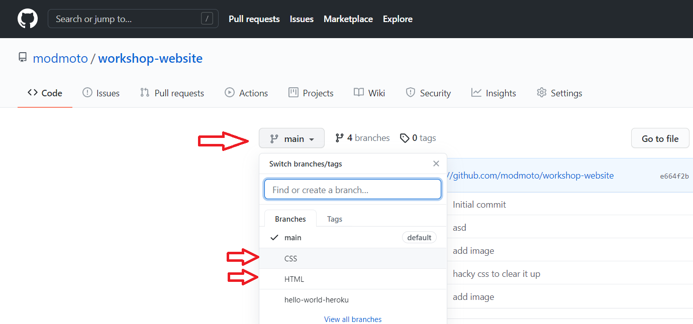

# HTML und CSS Beispiele

Hier findest du die HTML und CSS Beispiele für unseren Workshop. Hierbei kannst du auf den Branch `HTMl` oder `CSS` wechseln. Um den Branch zu wechseln, klicke oben auf das dropdown mit `main`:

